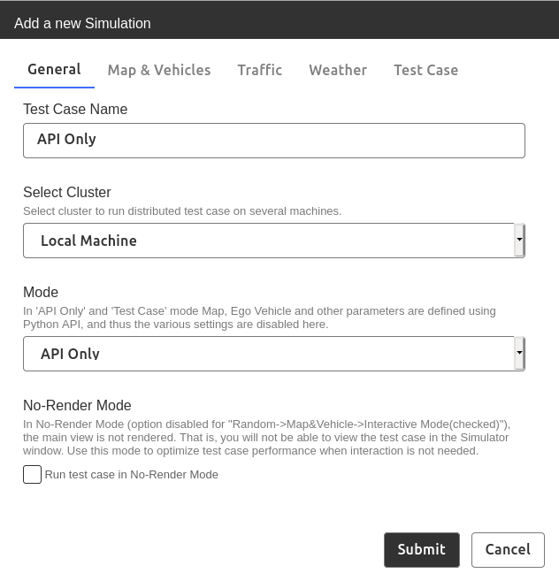

Python Runner
=============

Introduction
------------
Python Runner is a tool for the LGSVL Simulator which executes test cases written in Python using the [LGSVL Python API](https://www.lgsvlsimulator.com/docs/python-api/). 

Python scripts can be used to implement many different kinds of tests to run in the LGSVL Simulator.

Among the general use-cases of Python Runner are:

- Generating and testing random variations of various driving test cases
- Performing automated (e.g. acceptance) tests based on a set of repeatable test cases
- Performing automated regressions tests

This first preview release of the Python Runner provides the ability to perform several sample test cases in the LGSVL Simulator using Apollo for Autonomous Driving. This document describes how to run these tests with Apollo.

For example, one provided example is a "cut-in" test case which is performed on the San Francisco map (shown below).

Another provided example is a "sudden braking" test case which is performed on the SingleLaneRoad map (shown below). 

Additional examples demonstrate pedestrian-crossing test case which can be performed on the Straight1LanePedestrianCrosswalk map and the red-light runner test case which is performed on the Borregas Ave map. 


(Screen shot of the "cut-in" test case on the San Francisco map, above)


(Screen shot of the "sudden-braking" test case on the SingleLandRoad map, above)

### Package overview
Python Runner is delivered as a zip archive with the following directory layout:

```
lgsvlsimulator-scenarios-2020.05P-python-api
├── docker
│   └── lgsvl-simulator-scenarios-runner-2020.05P-python-api.tar
├── docs
│ ├── images
│ └── README.md
├── scenarios
│   ├── NHTSA
│   └── SampleTestCases
│       ├── cut-in.py
│       ├── ped-crossing.py
│       ├── red-light-runner.py
│       └── sudden-braking.py
├── install-testcase-runtime.sh
└── lgsvl_scenario.sh
```

- The `docker` directory contains a docker image saved as a tarball.
  - `lgsvl-simulator-scenarios-runner-<release-tag>-python-api.tar` contains the Python Runner tool
- The `docs` directory contains this README document
- The `SampleTestCases` directory contains four sample test cases:
  - `cut-in.py` is a vehicle cut-in test case on the San Francisco map
  - `sudden-braking.py` is a sudden braking test case on the SingleLaneRoad map
  - `ped-crossing.py` is a pedestrian crossing test case on the Straight1LanePedestrianCrosswalk map
  - `red-light-runner.py` is a red light runner test case on the Borregas Ave map
- `lgsvl_scenario.sh` is the Python Runner script that executes python-scripted test cases in the simulator through the simulator's Python API


### Python Runner workflow
1. Setup simulator in web UI
2. Launch simulator in API mode
3. Run the python runner script
4. Start the ego vehicle


Requirements
------------
Python Runner has these dependencies:

1. LGSVL Simulator -- the release tag of the simulator should match the release tag of Python Runner to ensure compatibility.
2. Apollo 5.0 lgsvl fork
3. Docker
4. Docker compose

### Downloading and launching the LGSVL Simulator

The Simulator release can be downloaded as a prebuilt binary from the premium release download page. Make sure to download the simulator binary from the same release as the resimulation release under use.

Download and extract the zip archive at the desired location. In the unzipped directory, run the executable file named simulator to launch the LGSVL Simulator.

The main window of the simulator will open up as seen below. Click on the Open Browser button to launch the simulator Web UI in a web browser. The Web UI controls all aspects of the simulator.


You will need to create an account to login to the Web UI. Once logged in you will be able to configure vehicles sensor arrangements, select maps, and create simulations to run in the simulator.

### Start LGSVL Simulator in API Only mode

- From the simulator Web UI click on the provided (default) API-only Test Case (formerly simulation), or create a new API-only Test Case if needed.


#### Creating the API-only Test Case (only if needed)
1. In the `Test Cases` tab in the Web UI click on `Add new` in the upper right corner.
2. In the `General` tab, enter a name for the Test Case (e.g. "API Only") and check the `API Only` box.
3. Click on `Mode` menu and select `API Only`. 
3. Click the `Submit` button to finish adding the test case.

    

#### Launching the API-only Test Case
1. In the `Test Cases` tab in the Web UI click on the `API Only` test case.
2. At the bottom of the Web UI, click on the red "Run" (triangle/play) button to start the API-only simulation.

See simulator documentation on the [Web UI Simulations tab](https://www.lgsvlsimulator.com/docs/simulations-tab/) for more information on setting up simulations.

Launching Apollo alongside the Simulator
-------------------------
### Installing (and Building) Apollo 5.0
Please follow the instructions on the LGSVL Simulator documentation website to for [Running Apollo 5.0 with LGSVL Simulator](https://www.lgsvlsimulator.com/docs/apollo5-0-instructions/) if you have not already done so. This will involve installing Docker CE, Nvidia Docker and the LGSVL Docker image, then cloning the lgsvl fork of the Apollo 5.0 sources, and finally building Apollo and the bridge.


### Start Apollo 5.0
- Open a terminal, change directory to the apollo-5.0 project (lgsvl fork: https://github.com/lgsvl/apollo-5.0), and type:
	- `./docker/dev_start.sh` to start apollo container
	- `./docker/dev_into.sh` to enter the container
	- Make sure you have built Apollo with GPU enabled options; for more details, refer to [Running Apollo 5.0 with LGSVL Simulator](https://www.lgsvlsimulator.com/docs/apollo5-0-instructions/).
	- `bootstrap.sh && bridge.sh &` to start the Apollo Dreamview Web UI and cyber_bridge.
- Open browser, enter address `localhost:8888`, and select `Lincoln2017MKZ` from the `vehicle` menu.
- Be sure to also select the correct map in Dreamview for the desired test case.
- Enable required modules in the `Module Controller` view before using the Python Runner including `Camera`, `Localization`, `Perception`, `Planning`, `Prediction`, `Routing`, `Traffic Light`, and `Transform`.


Using the Python Runner
-----------------------
### Setting up the Simulation
Running a simulation requires AssetBundles for the map and vehicle as well as configuration parameters for sensors. These should be downloaded automatically when the Simulator is first launched.

If errors appear due to previously-downloaded bundles from a previous version the Simulator, delete the Simulator persistent data folder located at `/home/[username]/.config/unity3d/LG Silicon Valley Lab/LGSVL Simulator`.

See simulator documentation for [how to add a map](https://www.lgsvlsimulator.com/docs/maps-tab/#how-to-add-a-map) and [how to add a vehicle](https://www.lgsvlsimulator.com/docs/vehicles-tab/#where-to-find-vehicles). AssetBundles are available for download at [the lgsvl simulator content website](https://content.lgsvlsimulator.com).

### Python Runner

Navigate to the unzipped directory of the Python Runner package in a terminal window. Then navigate to the scenarios directory.

The Python Runner script can be copied to the `~/local/bin/` directory if that directory is in the `$PATH`, or it can simply be referenced from the scenarios directory as `../lgsvl_scenario.sh`

#### Python Runner Commands

The Python Runner supports the following commands:

- `lgsvl_scenario.sh help` for help using the Python Runner
- `lgsvl_scenario.sh env` to print useful environment variables
- `lgsvl_scenario.sh run` to run a test case (with optional parameters)
- `lgsvl_scenario.sh run --help` for help running a test case
- `lgsvl_scenario.sh version` to print version information

#### Python Runner Parameters

The Python Runner supports the following command line parameters when running a test case:

- `-L, --log-level LEVEL` logging level
- `-h, --help`            show help message and exit

  
#### Python Runner Environment Variables

The Python Runner supports the following environment variables (and default values) when running a test case:

- `SIMULATOR_HOST=localhost`
- `SIMULATOR_PORT=8181`
- `BRIDGE_HOST=localhost`
- `BRIDGE_PORT=9090`

If simulator is being run on a separate machine than the Python Runner make sure to set the `SIMULATOR_HOST` environment variable with the IP address of the machine running the simulator; for example `export SIMULATOR_HOST=192.168.0.2`. 

The `BRIDGE_HOST` machine is the machine which is running Apollo (and the CyberRT bridge) and is most likely also the same machine running Python Runner. If simulator and Apollo are running on the same machine, use the default value of `localhost`. Otherwise, set `BRIDGE_HOST` to the IP address of the machine running Apollo; for example `export BRIDGE_HOST=192.168.0.1`.


Example Test Cases
------------------

There are several example test cases provided with the Python Runner in this preview release, summarized in the following table:

| Test Case           | Vehicle | Map                              | Destination |
|---------------------|---------|----------------------------------|-------------|
| cut-in.py           |   MKZ   | San Francisco                    | same lane before next intersection |
| ped-crossing.py     |   MKZ   | Straight1LanePedestrianCrosswalk | end of the map |
| red-light-runner.py |   MKZ   | Borregas Ave                     | other side of intersection |
| sudden-braking.py   |   MKZ   | SingleLaneRoad                   | end of the map |

Note that each map must be loaded and available in the Simulator Maps view, and the corresponding Apollo map must be available and selected in Dreamview. 

Also note that changing maps in Dreamview will disable the modules so you will need to re-enable them as described above.

### Cut-in Test Case

On a two lane road, an NPC cuts in front of ego vehicle from an adjacent lane while maintaining previous speed, with a small enough distance in front of ego vehicle such that ego vehicle will need to react by either changing speed (braking) or turning or swerving away.

This test case runs on the San Francisco map with the Lincoln MKZ ego vehicle driven by Apollo.

Be sure that the San Francisco map is selected in Dreamview, and that all required modules are enabled.

To run the Cut-in test case, navigate to the scenarios directory and type:

  `$``../lgsvl_scenario.sh run SampleTestCases/cut-in.py`

Then switch to the `Route Editing` view of Dreamview. Scroll (or zoom out) and click to set a destination in the same ego lane before the next intersection. Then click `Send Routing Request` and return to the `Module Controller` view to enable `Control`.

### Pedestrian Crossing Test Case

A pedestrian begins crossing a crosswalk as the ego vehicle approaches the intersection. The ego vehicle will need to slow down or come to a stop to wait for the pedestrian to finish crossing.

This test case runs on the Straight1LanePedestrianCrosswalk map with the Lincoln MKZ ego vehicle driven by Apollo.

Be sure that the Straight1LanePedestrianCrosswalk map is selected in Dreamview, and that all required modules are enabled.

To run the Pedestrian Crossing test case, navigate to the scenarios directory and type:

`$``../lgsvl_scenario.sh run ped-crossing.py`

Then switch to the `Route Editing` view of Dreamview. Scroll (or zoom out) and click to set a destination at the end of the map. Then click `Send Routing Request` and return to the `Module Controller` view to enable `Control`.


### Red Light Runner Test Case

While the ego vehicle attempts to cross a 4-way intersection with a green traffic light, an NPC crossing the intersection from the right runs a red light and crosses the intersection. The Ego must react by braking, stopping, or turning in order to avoid a collision.

This test case runs on the Borregas Ave map with the Lincoln MKZ ego vehicle driven by Apollo.

Be sure that the Borregas Ave map is selected in Dreamview, and that all required modules are enabled.

To run the Red Light Runner test case, navigate to the scenarios directory and type:

`$``../lgsvl_scenario.sh run red-light-runner.py`

Then switch to the `Route Editing` view of Dreamview. Scroll (or zoom out) and click to set a destination on the other side of the intersection. Then click `Send Routing Request` and return to the `Module Controller` view to enable `Control`.


### Sudden Braking Test Case

The ego vehicle follows an NPC vehicle that is traveling at the speed limit. The NPC suddenly brakes and comes to a stop. The ego vehicle will need to greatly reduce its speed to avoid a collision. After a few seconds, the NPC speeds back up gradually to the speed limit.

This test case runs on the SingleLaneRoad map with the Lincoln MKZ ego vehicle driven by Apollo.

Be sure that the Single Lane Road map is selected in Dreamview, and that all required modules are enabled.

To run the Sudden Braking test case, navigate to the scenarios directory and type:

`$``../lgsvl_scenario.sh run sudden-braking.py`

Then switch to the `Route Editing` view of Dreamview. Scroll (or zoom out) and click to set a destination at the end of the map. Then click `Send Routing Request` and return to the `Module Controller` view to enable `Control`.

### Known issues

- The AD stack (e.g. Apollo) should be controlled by the Python Runner, eliminating the need to manually set a destination in Dreamview.
