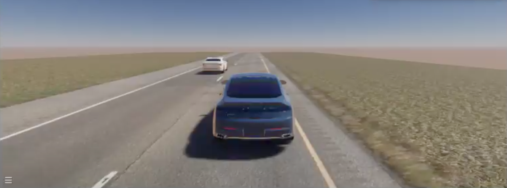
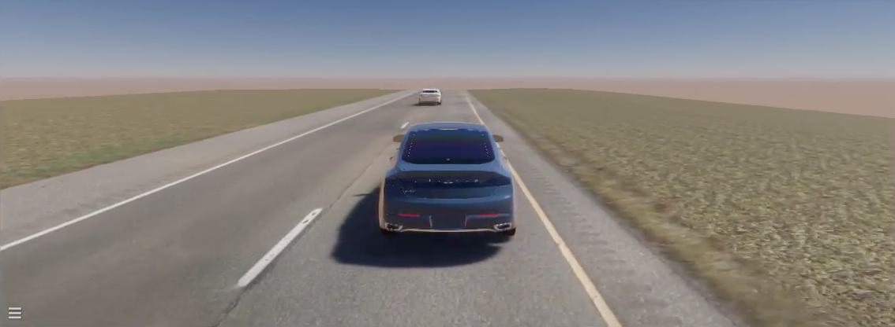
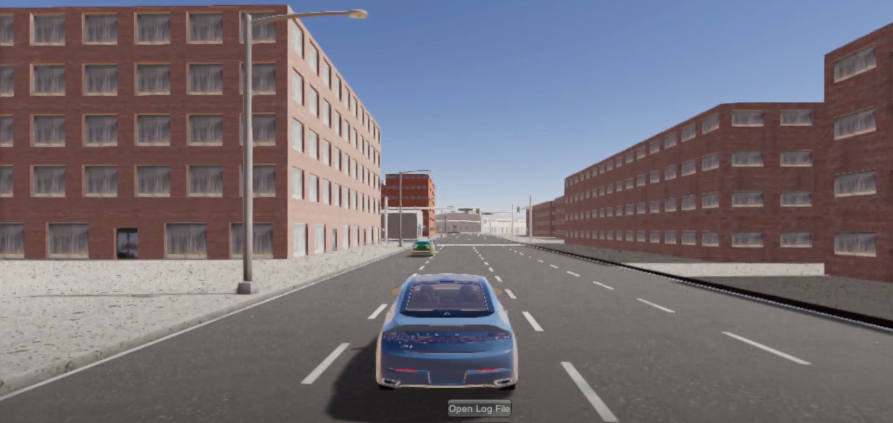
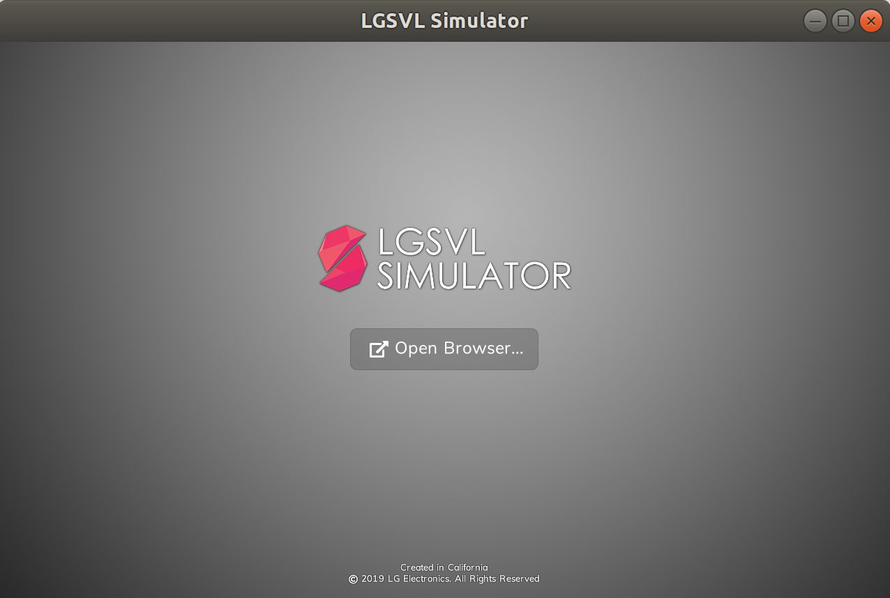
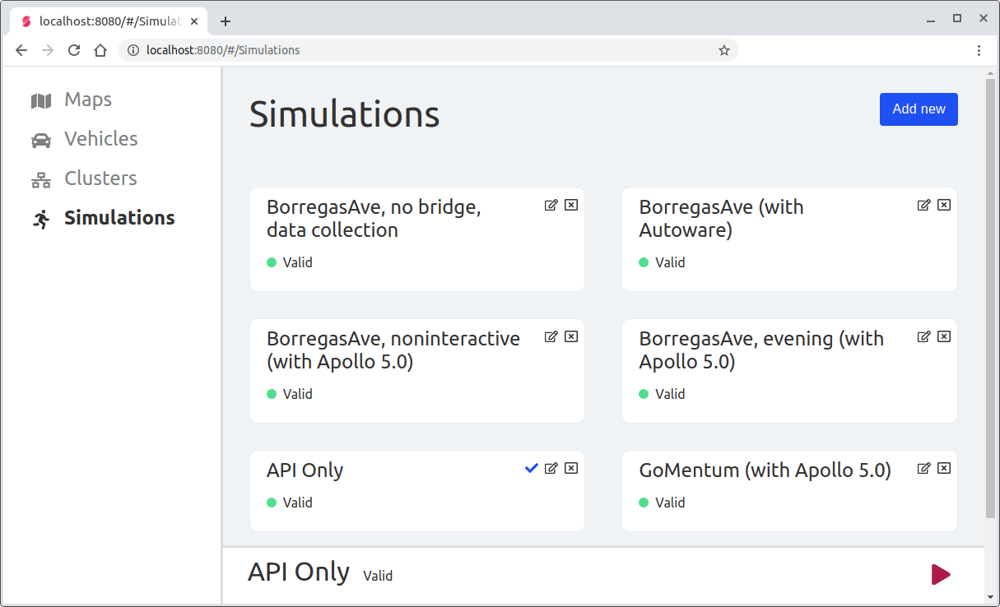
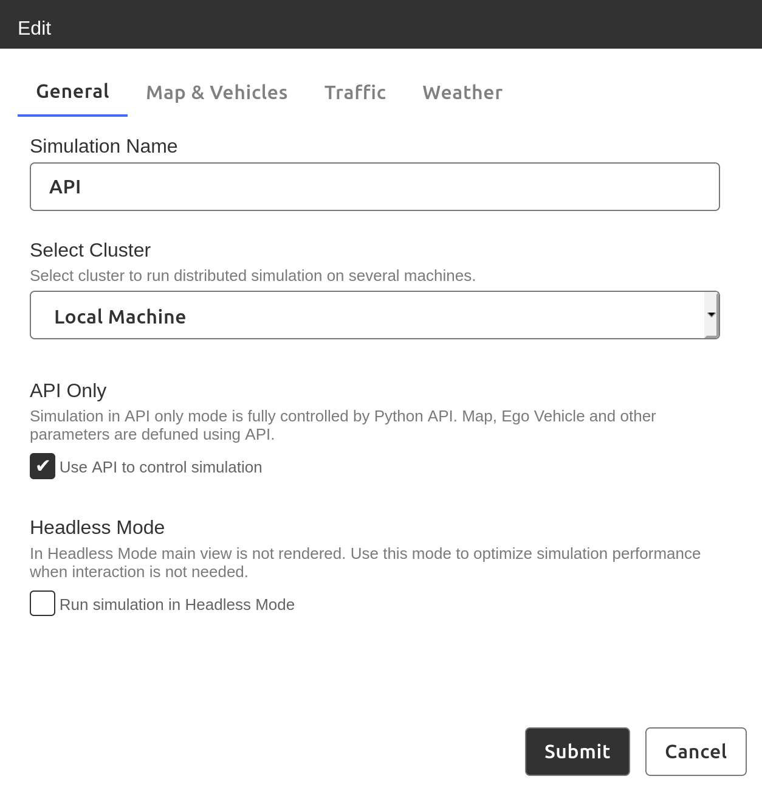

Scenario Runner
===============

Introduction
------------
Scenario Runner is a tool for the LGSVL Simulator which executes driving scenarios written in a high level Scenario Description Language called Scenic.

Scenarios can be defined where nearly everything is specified including locations, speeds, distances, actors, and environmental conditions (referred to as "concrete"), or they can be more "abstract" where some or all parameters are chosen at runtime, either randomly or across a distribution to ensure coverage over a range of possible values or options.

Among the use-cases of Scenario Runner are:

- Generating and testing random variations of abstract driving scenarios
- Performing automated (e.g. acceptance) tests based on a set of repeatable scenarios
- Performing automated regressions tests

This preview release provides the ability to perform several example scenarios in the LGSVL Simulator using Apollo for Autonomous Driving. This document describes how to run these scenarios.

For example, one provided example is an abstract "cut-in" scenario which can be performed on a test map (shown in the first two images below) or on other maps such as San Francisco (also shown in the image below).

Another provided example is a "random placement" scenario where the ego is randomly placed on a map such as Shalun and given a random destination to drive to. 

Additional examples demonstrate pedestrian-crossing scenarios which can be performed on the GoMentum map and also the Borregas Ave map. 





### Package overview
Scenario Runner is delivered as a zip archive with the following directory layout:

```
scenic-lgsvl-2020.04-rc1
├── docker
│   └── scenic_runner-2020.04-rc1.tar
├── docs
│ ├── images
│ └── README.md
├── scenarios
│   ├── borregas-intersection
│   │   └── scenic-borregas.sc
│   ├── cut-in
│   │   └── scenic-cut-in.sc
│   ├── gomentum-pedestrian-yield
│   │   └── gomentum-pedestrian-yield.sc
│   ├── maps
│   │   ├── BorregasAve.xodr
│   │   ├── GoMentum.xodr
│   │   ├── SanFrancisco.xodr
│   │   ├── Shalun.xodr
│   │   └── Straight2LaneSame.xodr
│   ├── random-placement
│   │   └── scenic-example.sc
└── scenic_lgsvl.sh
```

- The `docker` directory contains a docker image saved as a tarball.
  - `scenic_runner-<release-tag>.tar` contains the scenic runner tool.
- The `scenarios` directory contains three sample scenarios:
  - `borregas-intersection` is a pedestrian-crossing scenario on the Borregas map
  - `cut-in` is a vehicle cut-in scenario on a two lane road test map
  - `gomentum-pedestrian-yield` is a pedestrian-crossing scenario on the GoMentum map
  - `random-placement` is a scenario with random ego placement and destination
- `scenic_lgsvl.sh` is a Scenic Runner script that executes scenarios and plays them in the simulator by controlling the simulator's Python API and also controlling the Autonomous Driving stack (e.g. Apollo).

### Scenario Runner workflow
1. setup simulator in web UI
2. launch simulator in API mode
3. run the scenario runner script


Requirements
------------
Scenario Runner has these dependencies:

1. LGSVL Simulator -- the release tag of the simulator should match the release tag of Scenario Runner to ensure compatibility.
2. Apollo 5.0 lgsvl fork
2. Docker
3. Docker compose

### Downloading and launching the LGSVL Simulator
The Simulator release can be downloaded as a prebuilt binary from the [release page](https://github.com/lgsvl/simulator/releases) of the simulator on Github. Each release version has a list of "Assets" available for download. Since Scenario Runner runs in Linux, search for one of the Linux builds with a release tag matching the Scenario Runner release tag. The simulator will be provided as a zip file named `lgsvlsimulator-linux64-<release-tag>.zip
`.

Download and extract the zip archive at the desired location. In the unzipped directory, run the executable file named `simulator` to launch the LGSVL Simulator. 

The main window of the simulator will open up as seen below. Click on the `Open Browser` button to launch the simulator Web UI in a web browser. The Web UI controls all aspects of the simulator.



You will need to create an account to login to the Web UI. Once logged in you will be able to configure vehicles sensor arrangements, select maps, and create simulations to run in the simulator.

### Start LGSVL Simulator in API Only mode

- From the simulator Web UI click on the provided (default) API-only simulation, or create a new API-only simulation if needed.



#### Creating the API-only simulation (only if needed)
1. In the `Simulations` tab in the Web UI click on `Add new` in the upper right corner.
2. In the `General` tab, enter a name for the simulation and check the `API Only` box.
3. Click the `Submit` button to finish adding the simulation.

    

#### Launching the API-only simulation
1. In the `Simulations` tab in the Web UI click on the `API Only` simulation.
2. At the bottom of the Web UI, click on the read "Run" (triangle/play) button to start the API-only simulation.

See simulator documentation on the [Web UI Simulations tab](https://www.lgsvlsimulator.com/docs/simulations-tab/) for more information on setting up simulations.

Launching Apollo alongside the Simulator
-------------------------
### Installing (and Building) Apollo 5.0
Please follow the instructions on the LGSVL Simulator documentation website to for [Running Apollo 5.0 with LGSVL Simulator](https://www.lgsvlsimulator.com/docs/apollo5-0-instructions/) if you have not already done so. This will involve installing Docker CE, Nvidia Docker and the LGSVL Docker image, then cloning the lgsvl fork of the Apollo 5.0 sources, and finally building Apollo and the bridge.


### Start Apollo 5.0
- Open a terminal, change directory to the apollo-5.0 project (lgsvl fork: https://github.com/lgsvl/apollo-5.0), and type:
	- `./docker/dev_start.sh` to start apollo container
	- `./docker/dev_into.sh` to enter the container
	- Make sure you have built Apollo with GPU enabled options; for more details, refer to [Running Apollo 5.0 with LGSVL Simulator](https://www.lgsvlsimulator.com/docs/apollo5-0-instructions/)
	- `bootstrap.sh && bridge.sh &` to start the Apollo Dreamview Web UI and cyber_bridge
- Open browser, enter address `localhost:8888`, and select `Lincoln2017MKZ` from the `vehicle` menu
- Note: Apollo modules will be started and stopped by the Scenario Runner script; make sure all modules are off before running resimulation.


Using the Scenario Runner
------------------
### Setting up the simulation
Running a simulation requires AssetBundles for the map and vehicle as well as configuration parameters for sensors. These should be downloaded automatically when the Simulator is first launched.

If errors appear due to previously-downloaded bundles from a previous version the Simulator, delete the Simulator persistent data folder located at `/home/[username]/.config/unity3d/LG Silicon Valley Lab/LGSVL Simulator`.

See simulator documentation for [how to add a map](https://www.lgsvlsimulator.com/docs/maps-tab/#how-to-add-a-map) and [how to add a vehicle](https://www.lgsvlsimulator.com/docs/vehicles-tab/#where-to-find-vehicles). AssetBundles are available for download at [the lgsvl simulator content website](https://content.lgsvlsimulator.com).

### Scenario Runner

Navigate to the unzipped directory of the Scenario Runner package in a terminal window. Then navigate to the scenarios directory.

The Scenario Runner script can be copied to the `~/local/bin/` directory if that directory is in the $PATH, or it can simply be referenced from the scenarios directory as `../scenic_lgsvl.sh`

#### Scenario Runner Commands

The Scenario Runner supports the following commands:

- `scenic_lgsvl.sh help` for help using the Scenario Runner
- `scenic_lgsvl.sh env` to print useful environment variables
- `scenic_lgsvl.sh run` to run a Scenario with optional parameters
- `scenic_lgsvl.sh run --help` for help running a Scenario

#### Scenario Runner Parameters

The Scenario Runner supports the following command line parameters when running a scenario:

  `--num-iterations NUM_ITERATIONS, -i NUM_ITERATIONS`
                        Number of scenario iterations. (default: 42)

  `--duration DURATION, -d DURATION`
                        Maximum scenario duration in seconds. (default: 20.0)

  `--lgsvl-map MAP_NAME, -m MAP_NAME`
                        Map (default: GoMentum)

  `--output-dir OUTPUT_DIR, -O OUTPUT_DIR`
                        Default results output folder

  `--sampler, -s`       Save sampler data after simulation is finished.

  `--check, -t`         Parse scenic file and exit

  
#### Scenario Runner Environment Variables

The Scenario Runner supports the following environment variables (and default values) when running a scenario:

`SIMULATOR_HOST=localhost`

`SIMULATOR_PORT=8181`

`BRIDGE_HOST=localhost`

`BRIDGE_PORT=9090`

If simulator is being run on a separate machine make sure to set the `SIMULATOR_HOST` environment variable with the IP address of the machine running the simulator; for example `export SIMULATOR_HOST=192.168.0.2`. 

The `BRIDGE_HOST` machine is the machine which is running Apollo (and the CyberRT bridge) and is most likely also the same machine running Scenario Runner, so it should be fine with the default value of `localhost`.


Example Scenarios
------------------

There are several example scenarios provided with the Scenario Runner in this preview release.


### Random Placement Scenario

The Random Placement scenario will randomly place the ego vehicle on the map and then drive to a random destination.

To run the Random Placement scenario three times on the Shalun map, navigate to the scenarios directory and type:
`scenic_lgsvl.sh run -i 3 -m Shalun random-placement/scenic-example.sc`


### Cut-in Scenario

The cut-in scenario is a vehicle cut-in scenario for a two lane road. This is an abstract scenario that can be run on a test map or randomly on the San Francisco map. The NPC vehicle will start out next to the ego vehicle, start driving and then cut in front of the ego vehicle and come to a stop.

To run the Cut-in scenario twice on a test map, navigate to the scenarios directory and type:
`scenic_lgsvl.sh run -i 2 -m Straight2LaneSame cut-in/scenic-cut-in.sc`

To run the Cut-in scenario twice on the San Francisco map, navigate to the scenarios directory and type:
`scenic_lgsvl.sh run -i 2 -m SanFrancisco cut-in/scenic-cut-in.sc`


### Pedestrian Crossing Scenarios

The Pedestrian Crossing scenario demonstrates a vehicle approaching a crosswalk or turning at an intersection with a crosswalk. A pedestrian will enter the crosswalk forcing the ego vehicle to stop and wait for the pedestrian. This is a scenario that can be run on the GoMentum map or on the Borregas map.

To run the Pedestrian Crossing scenario three times on the GoMentum map, navigate to the scenarios directory and type:
`scenic_lgsvl.sh run -i 3 -m GoMentum gomentum-pedestrian-yield/gomentum-pedestrian-yield.sc`

To run the Pedestrian Crossing scenario ten times on the Borregas map, navigate to the scenarios directory and type:
`scenic_lgsvl.sh run -i 10 -m BorregasAve borregas-intersection/scenic-borregas.py`

### Known issues

- If the ego vehicle is not placed properly in a driveable lane, Apollo may not correctly drive the vehicle to the requested destination. This is a known issue and will be addressed in a future version of the Scenario Runner.
